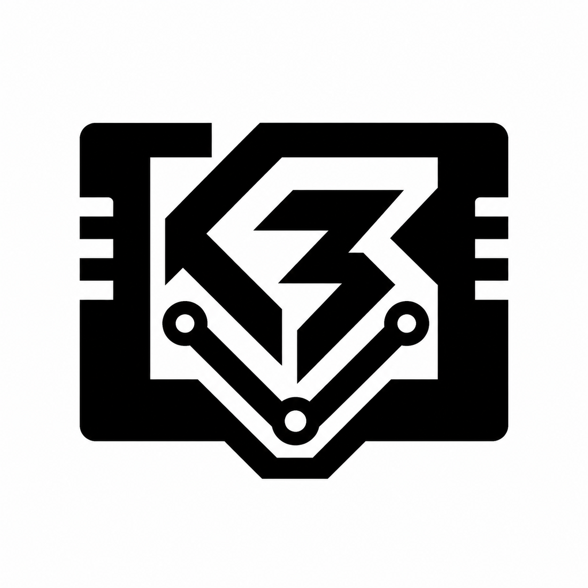

# K3V GBA for Analogue Pocket



[](https://github.com/KevinGaudry/k3v-gba/releases/latest)
[](https://github.com/KevinGaudry/k3v-gba/actions/workflows/build-branch.yml)
[](https://openfpga-library.github.io/analogue-pocket/)

K3V GBA is an open-source Game Boy Advance FPGA core for Analogue Pocket. The
first public K3V release is `v0.1.0`.

## Features

- RTC with powered-off catch-up and separate per-game `.rtc` state
- Save states and sleep
- Fast-forward on Y, with Fastest and Stable rendering modes
- Button turbo on X
- Display filters and high-quality audio
- Rumble
- Partial two-player link-cable support

Normal serial accessories, three/four-player link, GameCube link, wireless
adapter, and Single-Pak download are not currently implemented.

## RTC and save compatibility

RTC games use two independent files with the ROM's name, stored side by side in
Pocket's mirrored save tree:

- `/Saves/gba/common/.../<game>.sav` contains only the standard 64 or 128 KiB
  cartridge save.
- `/Saves/gba/common/.../<game>.rtc` contains K3V's 16-byte powered-off RTC
  state alongside the cartridge save.

Existing `v0.1.2` saves with an appended 16-byte footer migrate automatically.
The core accepts the old record and on the next clean exit writes a
standard-size `.sav` plus the `.rtc` sidecar. If both records are present, the
legacy footer is treated as the migration source; this also preserves changes
made after temporarily returning to `v0.1.2`. Back up saves before moving
between core versions; older releases do not load the new sidecar.

This uses the same per-game `.rtc` sidecar idea as newer EverDrive GBA
implementations, but the binary RTC formats are different and are not
interchangeable. The bundled legacy
[`rtc-save-tool.html`](pages/rtc-save-tool.html) can still inspect, repair, or
remove an appended footer locally in a browser; it does not upload saves.

The **Force RTC (ROM Hacks)** setting is only for games that implement RTC but
are not recognized automatically. It persists across games. Turn it off before
loading games that do not need it.

## Installation

1. Download the latest `K3V.GBA_<version>.zip` release package.
2. Merge its `Assets/`, `Cores/`, and `Platforms/` folders into the root of the
   Pocket SD card.
3. Put ROMs and `gba_bios.bin` in `/Assets/gba/common/`.

On macOS, merge folders manually because Finder may replace existing folders.

## Known limitations

- Fast-forward speed varies with each game's use of slower external memory.
- Fastest rendering can tear because the core does not have a spare framebuffer.
- 64 MiB GBA Video cartridges are not supported.
- Link-cable support is limited to the implemented two-player multiplayer path.

## Verification

The regression suite covers RTC behavior, Pocket bridge read pipelining, save
loading/unloading across asynchronous clock domains, PSRAM handshakes, invalid
save rejection, and stalled memory responses. Release builds additionally
require a clean Quartus compile,
fresh output files, complete custom TimeQuest reports, no critical warnings, and
non-negative timing slack. See [AUDIT_REPORT.md](AUDIT_REPORT.md).

## Building from source

Requirements:

- Python 3
- GHDL and Icarus Verilog for regression tests
- Quartus Prime Lite 21.1.1 Build 850, or Docker

Run the regressions:

```bash
python3 scripts/run_tests.py
```

Build and package:

```bash
./scripts/build.sh
```

On Windows PowerShell, use `./scripts/build.ps1`. A successful build creates
`dist/K3V.GBA_<version>.zip` plus SHA-256 and provenance sidecars.

## Upstream projects

- [MiSTer GBA](https://github.com/MiSTer-devel/GBA_MiSTer)
- [Analogue openFPGA](https://www.analogue.co/developer)
- [analogue-pocket-utils](https://github.com/agg23/analogue-pocket-utils)
- [budude2/openfpga-GBC](https://github.com/budude2/openfpga-GBC)

## License and provenance

This repository contains components under multiple compatible open-source
licenses plus Analogue and Intel framework/IP files under their original terms.
Copyright, licensing, and import provenance are preserved in [LICENSE](LICENSE),
[LICENSES](LICENSES), [NOTICE](NOTICE), and the individual source headers.
